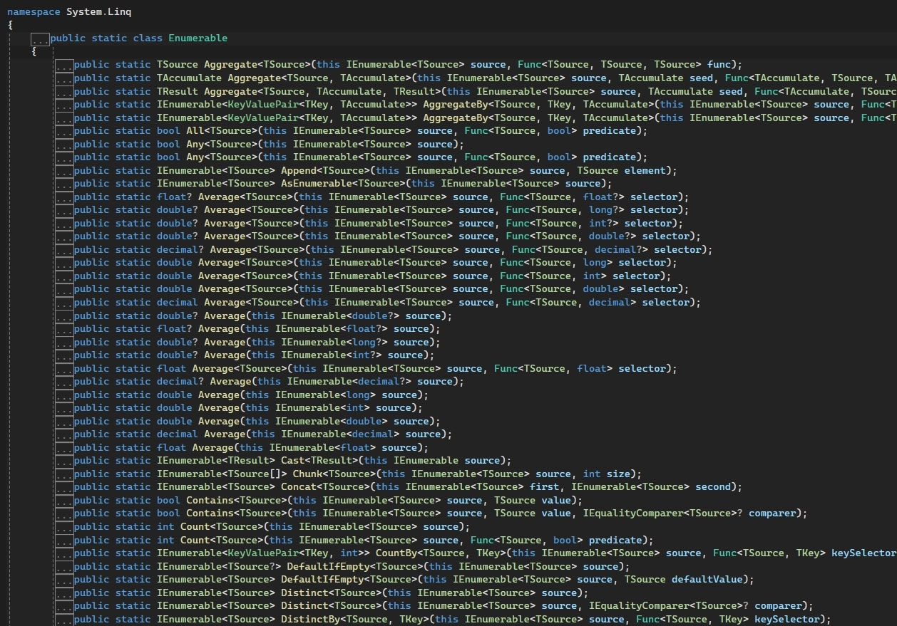

# <!--fit-->LINQsights
## Deep-Dives, Performanceanalysen und Tipps gegen Stolperfallen

<br/>

by David Ritter 
[devritter](https://www.github.com/devritter) @github

---

# Query Syntax or Method Syntax?

```csharp
(from x in LinqKnowledgeBase.GetAllInsights()
 where x.IsDeveloperRelevant && !x.IsWellKnown
 orderby x.Fancyness descending
 select new MeetupSlide(x.Headline, x.Content, x.DemoCode))
.Take(meetup.MaxSlides)
.TakeWhile(_ => !timer.IsTimeOver())
.ToList(); // or ToArray()?
```

<!-- Question upfront: who uses "query syntax", who "Method syntax"? -->

---

# <!-- fit --> First some basics!

---

# Before LINQ

* Nested loops
* Queries against data sources with strings
* Different APIs for different data sources

# With LINQ

* Query syntax integrated into the C# language => __L__-anguage __IN__-tegrated __Q__-uery
* Same query and transformation pattern against differerent data sources
* Type checking
* Expression Trees
* Lazy Evaluation

---

# Scope of This Presentation

* :x: LINQ to Objects / SQL / Entities
* :x: IQueryable
* :x: Expression<>
* :x: PLINQ
* :white_check_mark: IEnumerable and :white_check_mark: item streaming
* :white_check_mark: performance considerations
* :white_check_mark: pitfalls
* :white_check_mark: tips and tricks
* :white_check_mark: LINQPad

---

# LINQPad / NetPad (free)

* Super tools for C# scripting!
* no need for `.sln`, `.csproj`
* easily connect to databases and query data the LINQ-way!
* or just write some console apps :)
* `.Dump()` takes everything and displays it nicely!
* [LINQPad](https://www.linqpad.net)
* [NetPad](https://github.com/tareqimbasher/NetPad)

<!-- _footer: 00-meetup-description-verification.netpad -->

---

# Technical Basics

* `IEnumerable<T>`
* Extension methods
* Object Initializers `new SomeClass { PropA = x.Name }`
* Anonymouse Types `new { x.Name }`
* Local variable type inference `var`
* Lambda expressions `x => x.Size > 10`
* Expression Trees (for `IQueryable<T>`)

<!-- most of it with the release of C# 3.0, .NET Framework 3.5, 2007 -->

---

# What is an `IEnumerable<T>`?

* An interface
  * with one method: `IEnumerator<T> GetEnumerator()`
    * with mainly `Current` property and `bool MoveNext()` method
* implemented by:
  * `List<T>`
  * `T[]`
  * `Dictionary<TKey, TValue>`
  * `HashSet<T>`
  * `string` => `IEnumerable<char>`

---

# Can I create `IEnumerable<T>`s myself?

Of course!

```csharp
public static IEnumerable<string> MyItemFactory()
{
	yield return "I will";
	yield return "always return";
	yield return "the same starting text";
	
	if (DateTime.Now.DayOfWeek is DayOfWeek.Saturday or DayOfWeek.Sunday)
	{
		yield return "Did you know it's weekend?";
	}
	if (DateTime.Now.Year == 2012)
	{
		yield return "the end is near!!!";
		yield break;
	}

	yield return "thanks for iterating!";
}


// extra lines to fix slide rendering glitch
```

<!-- yield keyword is from C# 2.0 -->
<!-- add some "Thread.Sleep()" in between, then use .Take() at the caller -->
<!-- _footer: 05-yield.linq -->

---

# What if I don't have `IEnumerable<T>` :scream:?

```csharp
var myString = "Hello Meetup people!";
var matches = Regex.Matches(myString, "Meetup");
matches.First(); // <-- compile error! 
```

# Fixes

* `matches.OfType<Match>()`
* `matches.Cast<Match>()`
* `matches.OfType<object>()` / `matches.Cast<object>()`

<!-- _footer: 07-oftype-cast.linq -->

---

<!-- _backgroundImage: linear-gradient(to right, gray, gray) -->


---

# I use Lists / `.ToList()` always - that's ok, right?

Let's parse a CSV file
- Warehouse and retail sales
- 26 MB
- ~300k Lines

Question 1: How many items of type "WINE" are inside of this file?
Question 2: What's the RAM usage for that application?

<!-- start with File.ReadAllLines => +50MB memory, why? -->
<!-- replace with File.ReadAllLines -->
<!-- possibility to do "early exit" -->
<!-- Split(char) is faster than Split(string) -->

<!-- _footer: 10-csv-reading-bad.linq -->

---

# I use Lists / `.ToList()` always - that's ok, right?

* depends on what you will do with your data
* if you need to iterate over it multiple times
	* do you always need ALL data?
	* how FAST is your data source? (e.g. disk speed)
	* do some benchmarking!

<!-- when you only need some preview data, use .Take() upfront! -->

---


# .ToList() or .ToArray()?

Which is faster?

* Check if that's really your performance bottleneck ;)
* If your source is an `ICollection` already, it does not really make a big difference
* Do you really need everything in memory?
* depends on how you will modify the resulting collection

<!-- dig into .ToList() and .ToArray() -->
<!-- check out, why they are so fast -->
<!-- question your performance measurements! twist execution order, check computer load... -->
<!-- _footer: 20-tolist-toarray.linq, 21-tolist-toarray-wheretrue.linq -->

---


# So I make methods for `List<T>` AND `T[]` to be performant?

No, there is a better option!

`ICollection<T>`

---

# <!-- fit --> Materialize `.GroupBy()`

* Materialization = pull the data into memory
* like `.ToList()` and `.ToArray()`
* `.GroupBy()` still has deferred / lazy execution
* 3 options to materialize it:
  * `.ToList()` => `List<IGrouping<TKey, TValue>>`
  * `.ToDictionary()` => `Dictionary<TKey, List<TValue>>`
  * `.ToLookup()` => `ILookup<TKey, TValue>`
    * readonly!

<!-- _footer: 25-materialize-groupby.linq -->

---

# Don't know if `.Count()` could be expensive?
e.g. for Pagination controls
<br />

* use `TryGetNonEnumeratedCount(out int count)`
* even works with some other LINQ methods in place, like `.Reverse()` or `.Take()`

<!-- _footer: 30-count-if-cheap.linq -->

---

# <!-- fit --> `.Count() > 0` :shit:

Problems:

* reading all lines / files / ...
* to count every item ...
* just to say "oh yeah, there is something!"

---

# <!-- fit --> `.Count() > 0` :shit:

"Better" :see_no_evil: (from performance perspective):
* `.Count > 0` if you have an `ICollection<T>` / `List<T>`
* `.Length > 0` if you have an Array

But more expressive:
* `.Any()`
* `.HasContent()` => **BlazingExtensions**

<!-- "Any()" uses Count internally or just pulls one item -->

---

# `.Count()` / `.Any()` more readings
- [CA1860: Avoid using 'Enumerable.Any()' extension method](https://learn.microsoft.com/en-us/dotnet/fundamentals/code-analysis/quality-rules/ca1860)
- [CA1827: Do not use Count()/LongCount() when Any() can be used](https://learn.microsoft.com/en-us/dotnet/fundamentals/code-analysis/quality-rules/ca1827)
- [CA1829: Use Length/Count property instead of Enumerable.Count method](https://learn.microsoft.com/en-us/dotnet/fundamentals/code-analysis/quality-rules/ca1829)
* => make a team decision

---

# <!-- fit --> Checking for empty collections

Difficult to read:
* `myItems.Count() == 0`
* `myItems.Count == 0`
* `!myItems.Any()`
* `!myItems?.Any() ?? true`

Solution:
* `myItems.LacksContent()` => **BlazingExtensions**

---

# <!-- fit --> Beware of empty lists!

Which problems can occur here?

```csharp
someNumbers.Min();
someNumbers.Max();
someNumbers.Average();
someNumbers.Sum();
```

<!-- no problem with `.Sum()` ;) -->
<!-- but beware of using `.Count()` ! -->
<!-- _footer: 40-min-max-avg-empty-list.linq -->

---

# <!-- fit --> Beware of empty lists!

Solution:
```csharp
someNumbers = someNumbers.DefaultIfEmpty();
someNumbers.Min();
someNumbers.Max();
someNumbers.Average();
someNumbers.Sum();
```

<!-- no problem with `.Sum()` ;) -->
<!-- but beware of using `.Count()` ! -->
<!-- _footer: 40-min-max-avg-empty-list.linq -->

---

# <!-- fit --> Tipps for `null` items

* some methods like `.Sum()`, `.Min()`, `.Max()` just ignore `null` numbers
* think about what you want when using `.Count()`!
* to unwrap nullables use `.WhereNotNull()` from **BlazingExtensions**

<!-- when all items are null, we also get null back! (from Min/Max/Average) -->
<!-- Sum() always returns the number, even the signature tells differently... -->
<!-- What happens with an empty list? ==> no exceptions with int? -->
<!-- _footer: 45-null-items.linq -->

---

# <!-- fit --> Everything `All()`-right?

```csharp
int[] someNumbers = [1,5,10];

someNumbers.All(x => x > 0); 
// returns true

someNumbers.All(x => x > 10);
// returns false

someNumbers.Where(x => x > 10).All(x => x > 10);
// returns ?
```

* => `.BzAll()` from **BlazingExtensions**

<!-- _footer: 50-all.linq -->
<!-- ask for expected results -->

---

# <!-- fit --> Use `for`-loop features in LINQ

Your tasks:
1) only take every 10th element of a list
2) select ViewModel objects and set their ListIndex property

Solutions:
1) `items.Where((item, index) => index % 3 == 0)`
2) `items.Index().Where(x => new ViewModel { Index = x.Index, Name = x.Item.Name })`
<!-- names.Where((item, index) => index % 3 == 0).Dump(); -->
<!-- names.Index().Dump().Where(x => x.Index % 3 == 0).Dump(); -->
<!-- _footer: 60-linq-with-index.linq -->

--- 

# <!-- fit --> Is LINQ slower than `for` or `foreach`?

* it adds some overhead
* but I would not call it "slow"
* low-level operations (like `for`) are usually faster
* but Assembler would be even faster, so why not use Assembler?
* => Check for the real bottleneck!

<!-- remove .ToList() from first line... -->
<!-- _footer: 70-performance-linq-foreach-for -->

---

# <!-- fit --> One complexe `.Where()`
# <!-- fit --> or many small `.Where()`?

* the LINQ overhead adds up
* Behavior with `IQueryable<T>` could be different
* => prefer readable code!
* => make a team decision!
* => Check for the real bottleneck!

<!-- technically the WhereIterator combines the predicates. But still they are invoking delegates -->
<!-- _footer: 80-one-many-where.linq -->

---

# <!-- fit --> Skip `.Where()` when possible
* the predicate function needs to be invoked for every item
* if some conditions are the same for the whole iteration, we can get rid of the `WhereIterator`
* but only measurable for huge lists!
* => prefer readable code!

<!-- _footer: 85-skip-where.linq, 86-skip-where-solution.linq -->

---

# Should I use `.Where(x => ...).Count()` or `.Count(x => ...)`?

* Regarding the small LINQ overhead `Count(x => ...)` should be faster
* When using `IQueryable<T>` you will have the same resulting SQL
* => make a team decision!

[GitHub Issue](https://github.com/dotnet/runtime/issues/64728)

---

# <!-- fit --> List flattening with `.SelectMany()`

```csharp
var peopleWithPets = new[] {
    new { Name = "Anna",   Pets = new[] { "Dog", "Cat", "Parrot" } },
    new { Name = "Ben",    Pets = new[] { "Fish", "Hamster", "Snake" } }
};

var allPets = peopleWithPets.SelectMany(p => p.Pets);

foreach (var pet in allPets)
{
    Console.WriteLine(pet);
}
```

<!-- _footer: 90-list-flattening.linq -->

---

# <!-- fit --> Utility Methods

for playing around or unit tests

```csharp
// empty collections
Enumerable.Empty<T>();
Array.Empty<T>();

// create lots of numbers
Enumerable.Range(1_000_000, 2_000_000);

// create a huge list for processing
Enumerable.Repeat(new ComplexObject(), 1_000_000);)
```

---

# <!-- fit --> Thanks for listening!

Further links:
- BlazingExtensions on [GitHub](https://github.com/devritter/BlazingExtensions) and [NuGet](https://www.nuget.org/packages/BlazingDev.BlazingExtensions/)
- [BenchmarkDotNet](https://github.com/dotnet/BenchmarkDotNet)
- [LINQPad](https://www.linqpad.net/)
- [NetPad](https://github.com/tareqimbasher/NetPad)